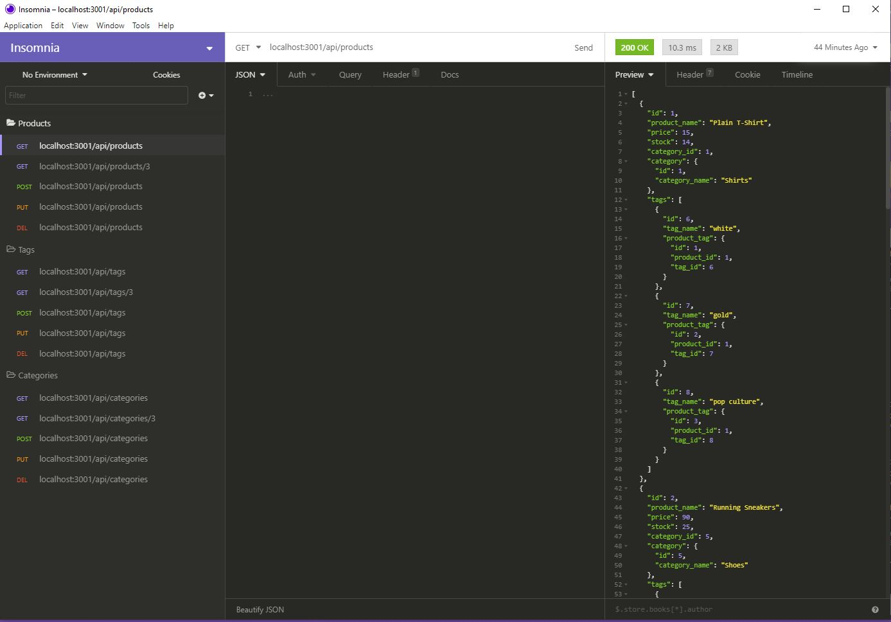
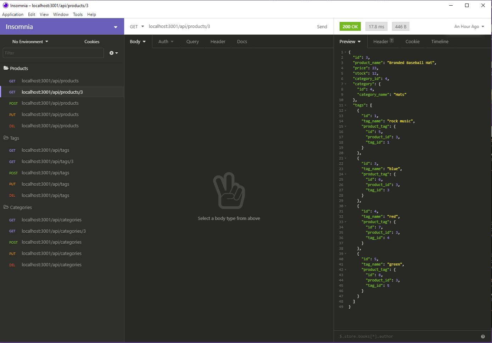
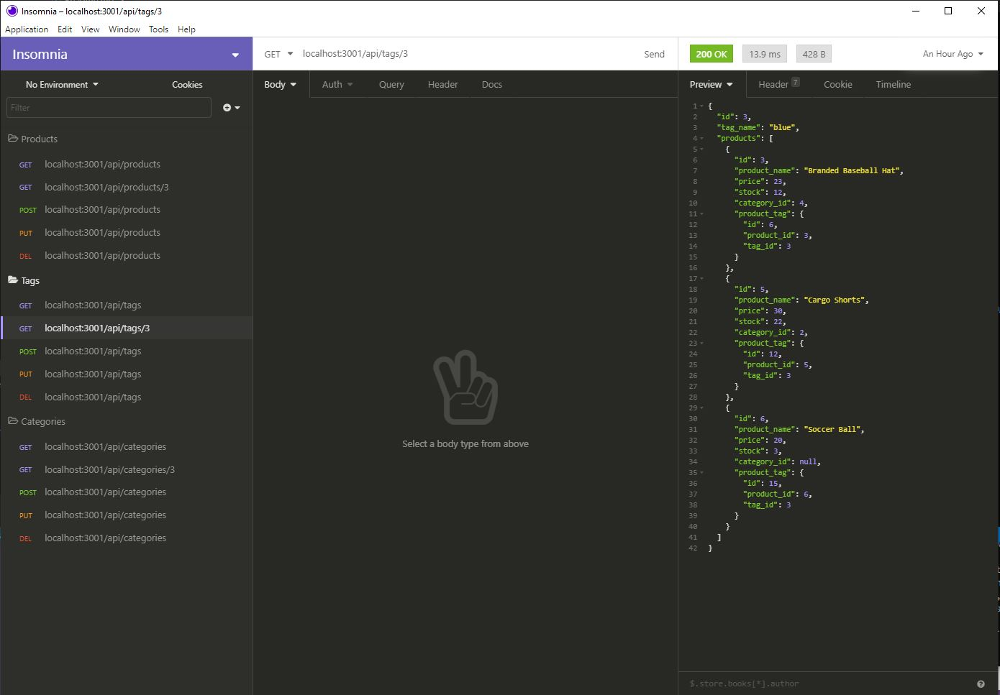
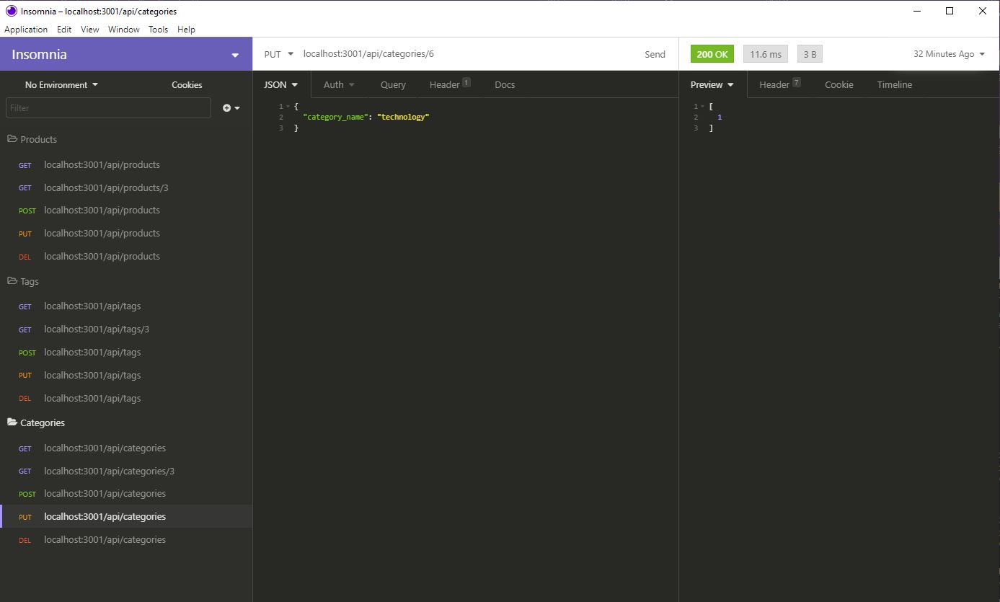

# E-Commerce Template

## Deployed site

https://mrllanes.github.io/E-commerce-Back-End/
https://github.com/mrllanes/E-commerce-Back-End

## Table of Contents

-   [Description](#description)
-   [Installation](#installation)
-   [Usage](#usage)
-   [Technology](#technology)
-   [Contributions](#contributions)
-   [Questions](#questions)

## Description

E-Commerce is everywhere on the internet. If you have products to sell, it is the easiest way to reach the masses. Here you will find a simple backend template using MySQL for the product adding, tracking, apdating and deleting.

## Installation Instructions

-   Branch to the repo
-   Download the files locally
-   Run node install
-   Create a MySQL database named "ecommerce_db" using the command line or MySQL Workbench.
-   Run "node run seed"
-   Launch the code using "node index"

## Usage

You can use a program such as Postman, Insomnia or even your web browser to view and post information into the database.

## Technology Stack

The following technologies were used to create this site/application/software/project:
Javascript, Node (Express, Sequelize, MySQL), Insomnia, Git Bash

## Contributions

The following individuals contributed to the creation of this site/application/software/project:
Super Awesome support team and Incredibly Awesome Instructor/Facilitator. Also very nice and enthusiastic Cohort members.

## Questions

If you have questions or comments about this project, please feel free to contact me via e-mail:
llanesm@gmail.com

You can also find more of my projects on my GitHub page:
https://github.com/mrllanes

## Screenshots

Please see the images below to see how the CLI Employee Tracker App looks!

